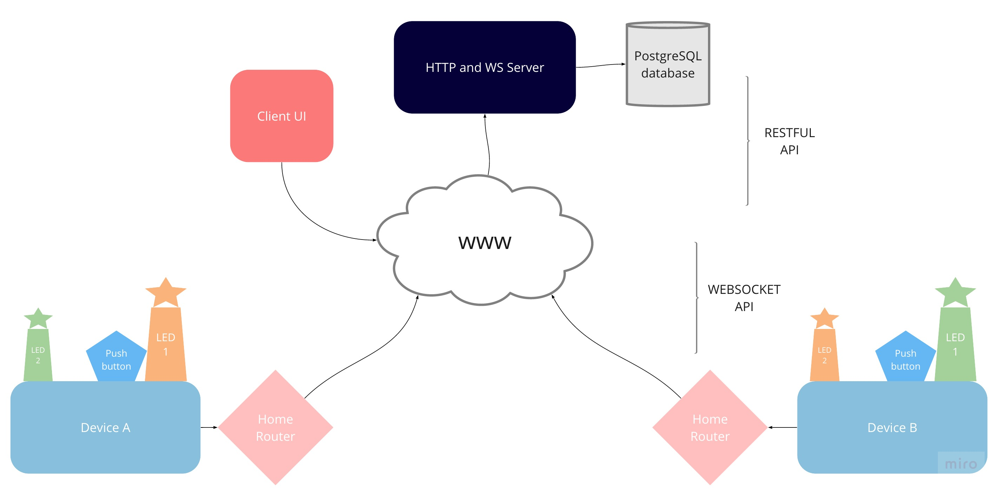

## 1. Purpose

- To build the simplest IoT architecture: 2 embedded systems connected via the internet
- Goal is to send one bit from my private local area network to my partners as a signal of presence
- Both my partner and I have:
  - (1) a push button
  - (2) a light that we control (LED 1)
  - (3) a light that our partner controls (LED 2)
- The bit that is sent from my device controls LED 1 on my board, and LED 2 on my partners board
  - LED 1 on my device and LED 2 on theirs should be updated in real time and always in sync
  - LED 2 on my device and LED 1 on theirs should be updated in real time and always in sync
- The bit that is sent is determined by a push button on my board, and/or a user action triggered through a remotely hosted UI
- We both have user accounts with our registered devices saved in a postgreSQL database and access to them through a UI hosted on the remote web server
- Why? To explore IoT fundamentals from the bottom up: hardware (electrical circuitry, memory capacity, energy consumption, sensors and actuators), issues of latency (blocking system calls, asynchronous RPC’s, dropped packets), security (network configuration, packet sniffing, encryption, authentication)

## 2. Summary of high level architecture

## 3. Installation

### Device components required

- 2 Arduino MKR1000 microcontroller boards equipped with WifiShields
- 2 breadboards
- 4 LEDs (2 per board)
- 2 push buttons
- 6 Resistors
- ~12 connector wires
- 2 USB connectors for developing on Arduinos
- Home Router acting as a Wireless Access Point to WWW

## 4. Control flow

- Device connects to WIFI when powered on
- Device connects to remote web socket server as a client via TCP socket
- Device sends its MAC address as a message immediately after connection
- TODO: The server verifies the identity of the device (ssh?)
- The server sends back a number code (3 or 4 at this point - 3 if the device is the only one connected to websocket server)
- API server → device leading bit meaning:
  - 0: light off
  - 1: light on
  - 3: light off : signal no partner and no available actions
  - 4: light on : signal partner online and is ready to send/receive
- All messages from server _to_ device are formatted as concatenated string composed of `<BIT><IPADDRESSOFSENDINGDEVICE>` so device can know which light to turn on
- The server relays the bit to the partner device and back to sending device in above mentioned format
- All messages from device _to_ server are formatted without the concatenated IP, unlike messages _from_ the server
- When the button is pressed on the device itself a 0 or 1 is sent from the device to server (and will only be 0 or 1, devices do not send 3 or 4s, those are reserved for the server)
- The device owner can _also_ use the UI hosted on webserver to simulate a button push on the device by registering a user/password and their device's MAC
- TODO: The registration and login information is sent over HTTPS rather than HTTP (lets encrypt and nginx?)
- In the case of updating the device from the UI, the server checks which device is registered to the currently logged in user, whether that device is connected to the websocket server, and sends the bit on behalf of that device

## 5. TODO (continued)

- Polish UI (table views of device information)
- Move views into own folder
- Decouple websocket for devices and REST UI endpoints for clients
- Block updating through UI as soon as device partner disconnects from server
- Return statuses and json payloads
- Input validation
- Indexes on database queries
- Add missing entities for multiple users
